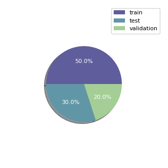
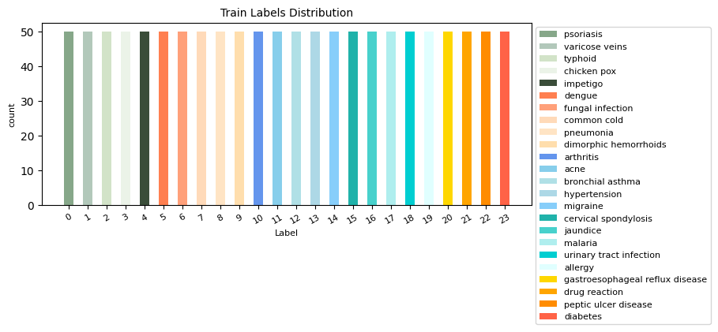
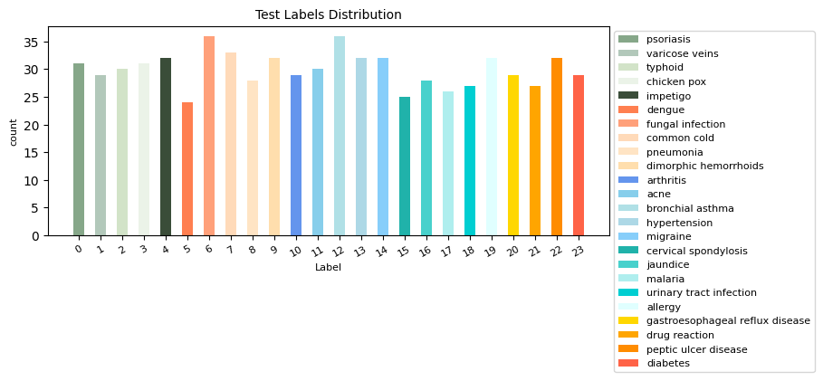
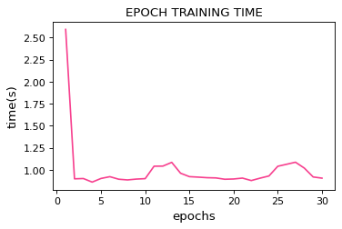
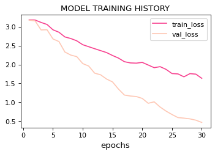
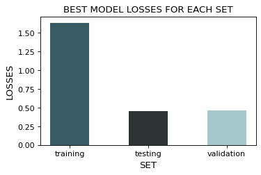
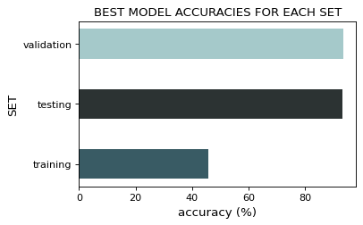

### S2DC (Symptoms to Disease Classifier)

😷💉💊🤮🤒 Symptoms to Disease Classifier, is an Artificial Intelligent (AI) mobile tool that is used to classify diseases from people based on the textual symptoms the person provides.

<p align="center">
    
</p>

<p align="center">
<a href="https://github.com/crispengari/S2DC/actions/workflows/server-ci.yml"></a>
<a href="/LICENSE"></a>
</p>

### Table of Contents

- [S2DC (Symptoms to Disease Classifier)](#s2dc-symptoms-to-disease-classifier)
- [Table of Contents](#table-of-contents)
- [Problem Statement](#problem-statement)
- [Data](#data)
- [Demo](#demo)
- [Testing `S2DC` app](#testing-s2dc-app)
- [Model Training and Evaluation](#model-training-and-evaluation)
  - [Training time and last saved epoch.](#training-time-and-last-saved-epoch)
  - [Training time per epoch](#training-time-per-epoch)
  - [Training \& Validation Accuracies.](#training--validation-accuracies)
  - [Training \& Validation Losses.](#training--validation-losses)
  - [Best model accuracy and loss](#best-model-accuracy-and-loss)
  - [Confusion matrix.](#confusion-matrix)
  - [Classification report](#classification-report)
- [Notebooks](#notebooks)
- [License](#license)

### Problem Statement

> "Most people have certain symptoms and they fail to identify wether they are sick or not. Sometimes others even ignore the symptoms because they lack knowledge. Using Deep Learning techniques we want to implement an AI tool that will be able to identify the possible disease based on description of the symptoms by someone who's feeling sick."

In this project I will create a simple classification model that will be able to classify the `disease` based on symptoms from text.

Our AI tool will be able to diagnose `24` diseases which are:

- `Psoriasis`
- `Varicose Veins`
- `Typhoid`
- `Chicken pox`
- `Impetigo`
- `Dengue`
- `Fungal infection`
- `Common Cold`
- `Pneumonia`
- `Dimorphic Hemorrhoids`
- `Arthritis`
- `Acne`
- `Bronchial Asthma`
- `Hypertension`
- `Migraine`
- `Cervical spondylosis`
- `Jaundice`
- `Malaria`
- `urinary tract infection`
- `allergy`
- `gastroesophageal reflux disease`
- `drug reaction`
- `peptic ulcer disease`
- `diabetes`

### Data

The dataset was obtained on [kaggle](https://www.kaggle.com/datasets/niyarrbarman/symptom2disease) and was loaded from google drive from a `csv` file and the examples were split into `3` set's out of `2, 400` examples that we had.

| Set          | Example(s) |
| ------------ | ---------- |
| `training`   | `1200`     |
| `validation` | `480`      |
| `testing`    | `720`      |
| `total`      | `2400`     |

The following pie chat represents the data distribution in those sets.

<p align="center">
    
</p>

After splitting the data into `3` sets then the distribution of labels where visualized.

<p align="center">
    
    <br/>
    
    <br/>
    
</p>

### Demo

This is a demo video showing how the application works.

https://user-images.githubusercontent.com/59051957/235310636-f2794234-7705-4867-a7a3-3d1d01b0aad8.mp4

### Testing `S2DC` app

You can test this application locally, you just need to follow the following instructions that will help you play around with our tool in development mode.

1. clone this repository by running:

```shell
https://github.com/CrispenGari/symptoms-to-disease-classifier.git
```

2. navigate to the server by running the following command:

```shell
cd  server
```

3. create a virtual environment on the server folder, activate it and install required packages by running the following command:

```shell
virtualenv venv && .\venv\Scripts\activate
```

4. Start the server by running the following command:

```shell
python server.py
```

5. When the server is running it will start on a default port of `3001` go ahead and open `ngrok` cli and run the following command:

```shell
ngrok http 3001
```

6. Copy the forwarding url from the `ngrok` shell that looks as follows:

```shell
Forwarding                    https://4c1a-102-66-137-117.ngrok-free.app -> http://localhost:3001
```

7. Navigate to the `client/src/constants/index.ts` file and change the constant `serverBaseURL` to the forwarding url for example as follows:

```ts
export const serverBaseURL: string =
  "https://4c1a-102-66-137-117.ngrok-free.app";
```

8. Now you can start the expo app but first navigate to the `client` on another terminal and run the following command:

```shell
cd client && yarn && expo install && yarn start
```

9. Scan the `QR` code using your phone and start using the `tool`. Make sure that you have `expo-go` installed in your `android` or `ios` phone before scanning the `QR` code.

### Model Training and Evaluation

In this section we are going to visualize how the model training history and the best model metrics.

#### Training time and last saved epoch.

|                     | value        |
| ------------------- | ------------ |
| TOTAL EPOCHS        | `30`         |
| LAST SAVED EPOCH    | `30`         |
| TOTAL TRAINING TIME | `0:00:31.23` |

#### Training time per epoch

The following graph shows the training time each epoch took to complete on the batched data.

<p align="center">
    
</p>

#### Training & Validation Accuracies.

The following graph shows the train and validation accuracies that were observed per epoch during model training.

<p align="center">
    
</p>

#### Training & Validation Losses.

The following graph shows the train and validation losses that were observed per epoch during model training.

<p align="center">
    
</p>

#### Best model accuracy and loss

The following table shows the best model metric in terms of loss and accuracy based on the test dataset.

| Set    | Loss    | Accuracy  | ETA (time) |
| ------ | ------- | --------- | ---------- |
| `Test` | `0.456` | ` 93.23%` | -          |

The best model was then evaluated using each `set` and the following graphs shows the losses obtained and accuracies for each set respectively.

<p align="center">
   
   <br/>
    
</p>

#### Confusion matrix.

The confusion matrix for the best model can be found [here.](https://github.com/CrispenGari/nlp-pytorch/blob/main/11_SYMPTOMS_2_DISEASE_CLASSIFICATION/01_SYMPTOMS_2_DISEASE_CLASSIFICATION.ipynb)

#### Classification report

Here is the classification report table for the best model, after it have been evaluated on the `test` set.

|                | precision | recall | f1-score | support |
| -------------- | --------- | ------ | -------- | ------- |
| `0`            | `0.81`    | `1.00` | `0.90`   | `22`    |
| `1`            | `1.00`    | `1.00` | `1.00`   | `18`    |
| `2`            | `0.95`    | `0.91` | `0.93`   | `22`    |
| `3`            | `0.94`    | `0.76` | `0.84`   | `21`    |
| `4`            | `1.00`    | `1.00` | `1.00`   | `22`    |
| `5`            | `0.70`    | `0.50` | `0.58`   | `14`    |
| `6`            | `1.00`    | `1.00` | `1.00`   | `23`    |
| `7`            | `0.97`    | `0.97` | `0.97`   | `29`    |
| `8`            | `0.90`    | `1.00` | `0.95`   | `18`    |
| `9`            | `0.96`    | `1.00` | `0.98`   | `22`    |
| `10`           | `1.00`    | `1.00` | `1.00`   | `18`    |
| `11`           | `1.00`    | `1.00` | `1.00`   | `19`    |
| `12`           | `1.00`    | `0.92` | `0.96`   | `25`    |
| `13`           | `1.00`    | `1.00` | `1.00`   | `19`    |
| `14`           | `1.00`    | `1.00` | `1.00`   | `22`    |
| `15`           | `0.94`    | `1.00` | `0.97`   | `16`    |
| `16`           | `1.00`    | `1.00` | `1.00`   | `18`    |
| `17`           | `1.00`    | `1.00` | `1.00`   | `17`    |
| `18`           | `0.94`    | `1.00` | `0.97`   | `17`    |
| `19`           | `1.00`    | `0.74` | `0.85`   | `19`    |
| `20`           | `0.80`    | `1.00` | `0.89`   | `20`    |
| `21`           | `0.74`    | `0.85` | `0.79`   | `20`    |
| `22`           | `0.93`    | `0.68` | `0.79`   | `19`    |
| `23`           | `0.78`    | `0.90` | `0.84`   | `20`    |
| `accuracy`     |           |        | `0.93`   | `480`   |
| `macro avg`    | `0.93`    | `0.93` | `0.92`   | `480`   |
| `weighted avg` | `0.94`    | `0.93` | `0.93`   | `480`   |

### Notebooks

The `.ipynb` notebook that was used to train and save the model can be found:

1. [01_SYMPTOMS_2_DISEASE_CLASSIFICATION](https://github.com/CrispenGari/nlp-pytorch/blob/main/11_SYMPTOMS_2_DISEASE_CLASSIFICATION/01_SYMPTOMS_2_DISEASE_CLASSIFICATION.ipynb)

### License

This project is under the [`MIT` license ](/LICENSE).
